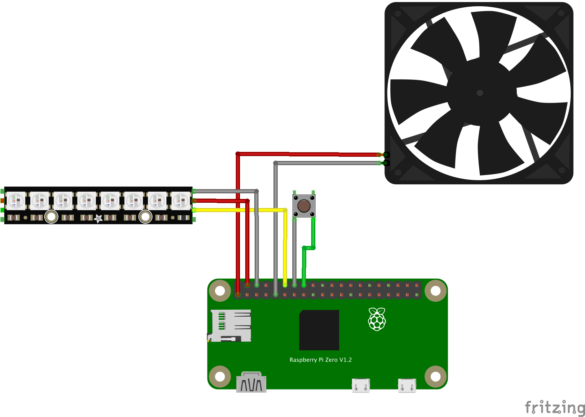

# Script for controlling PINAS

## Wiring



## Setup environment

### Install python3 pip

> https://www.pantechsolutions.net/blog/installing-library-packages-in-raspberry-pi/

```bash
sudo apt update
sudo apt upgrade
sudo apt-get install python3-pip
```

### Install `Neopixel` lib

> https://learn.adafruit.com/neopixels-on-raspberry-pi/python-usage

```bash
sudo pip3 install rpi_ws281x adafruit-circuitpython-neopixel
```

### Install `Button` lib

> https://www.makeuseof.com/tag/add-button-raspberry-pi-project/

```bash
sudo pip3 install gpiozero
```

### Clone script

```bash
cd /home/pi/
git clone https://github.com/RyanDam/PINAS_Controller.git
```

- Note: make sure project is at `/home/pi/PINAS_Controller`

### Install script service

```bash
chmod +x pinas_script.service
```

```bash
sudo cp pinas_script.service /etc/systemd/system/
```

### Start script service

```bash
sudo systemctl start pinas_script.service
```

### Enable auto start script service at system startup

```bash
sudo systemctl enable pinas_script.service
```

### Check if service is running

```bash
sudo systemctl status pinas_script.service
```